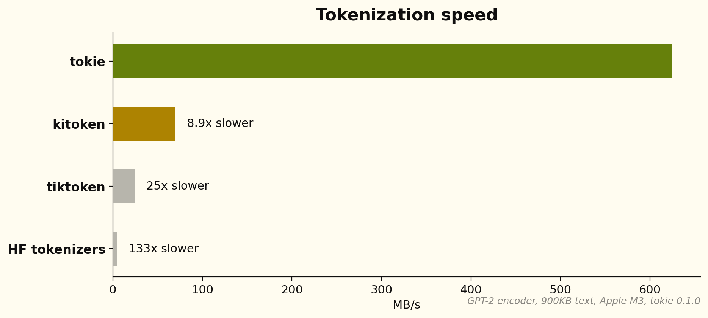
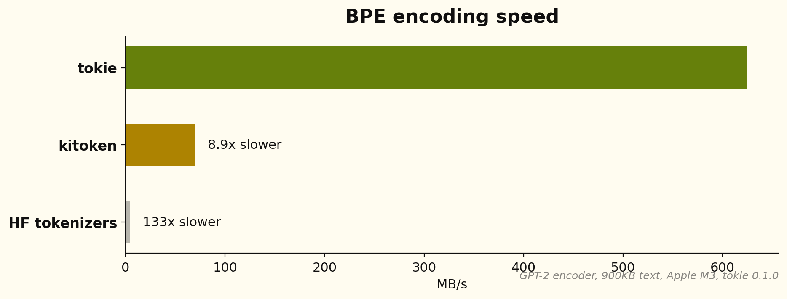
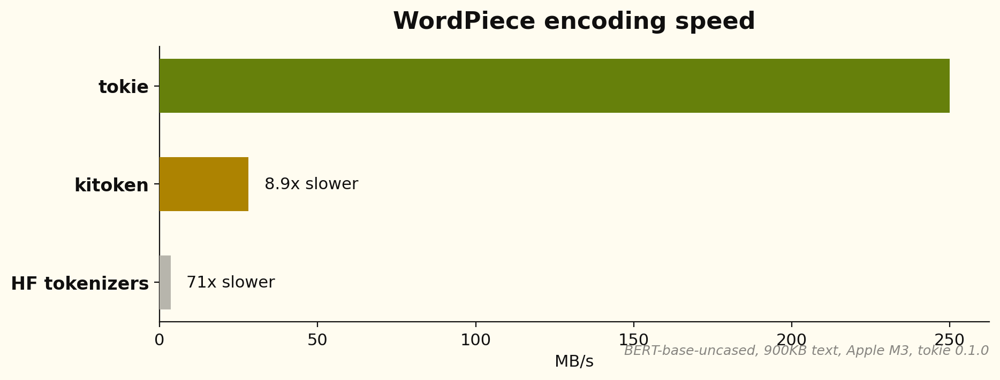
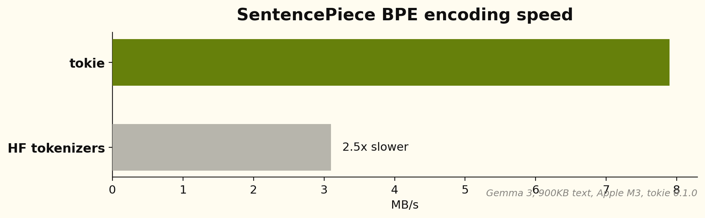
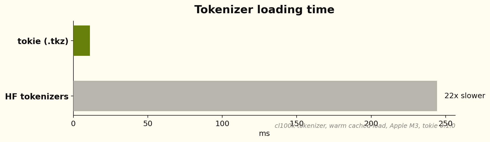

<div align="center">


# tokie

[](https://crates.io/crates/tokie)
[](https://pypi.org/project/tokie/)
[](https://crates.io/crates/tokie)
[](https://pypi.org/project/tokie/)
[](LICENSE-MIT)
[](https://docs.rs/tokie)
[](https://github.com/chonkie-inc/tokie)

*25-150x faster than HuggingFace, 100% accurate drop-in replacement*

[Install](#install) •
[Quick Start](#quick-start) •
[Examples](#examples) •
[Benchmarks](#benchmarks) •
[Why tokie?](#why-tokie)

</div>

> [!CAUTION]
> tokie is in its alpha stage and might produce mis-aligned output. Please report any issues you encounter.

**tokie** is a Rust tokenizer library (with Python bindings) that can load any tokenizer on HuggingFace and tokenize 25-150x faster. It supports every major algorithm — BPE, WordPiece, SentencePiece, and Unigram — and is 100% token-accurate, every time.



## Install

### Python

```bash
pip install tokie
```

### Rust

```toml
[dependencies]
tokie = { version = "0.0.8", features = ["hf"] }
```

## Quick Start

### Python

```python
import tokie

# Load any HuggingFace tokenizer
tokenizer = tokie.Tokenizer.from_pretrained("bert-base-uncased")

# Encode — returns Encoding with ids, attention_mask, type_ids, tokens
encoding = tokenizer("Hello, world!")  # or tokenizer.encode("Hello, world!")
print(encoding.ids)             # [101, 7592, 1010, 2088, 999, 102]
print(encoding.tokens)          # ['[CLS]', 'hello', ',', 'world', '!', '[SEP]']
print(encoding.attention_mask)  # [1, 1, 1, 1, 1, 1]

# Decode
text = tokenizer.decode(encoding.ids)  # "hello , world !"

# Count tokens without allocating
count = tokenizer.count_tokens("Hello, world!")  # 6

# Batch encode (parallel across all cores)
encodings = tokenizer.encode_batch(["Hello!", "World"], add_special_tokens=True)
```

### Rust

```rust
use tokie::Tokenizer;

let tokenizer = Tokenizer::from_pretrained("bert-base-uncased")?;
let encoding = tokenizer.encode("Hello, world!", true);
println!("{:?}", encoding.ids);             // [101, 7592, 1010, 2088, 999, 102]
println!("{:?}", encoding.attention_mask);  // [1, 1, 1, 1, 1, 1]

let text = tokenizer.decode(&encoding.ids).unwrap();
```

## Examples

### Padding & Truncation

For ML inference, you need fixed-length inputs. tokie supports padding and truncation just like HuggingFace:

```python
tokenizer = tokie.Tokenizer.from_pretrained("bert-base-uncased")

# Truncate to max length
tokenizer.enable_truncation(max_length=128)

# Pad to fixed length (or use BatchLongest for dynamic padding)
tokenizer.enable_padding(length=128, pad_id=0)

# All outputs are now exactly 128 tokens
results = tokenizer.encode_batch(["Short text", "A much longer piece of text for testing"])
assert all(len(r) == 128 for r in results)

# attention_mask shows which tokens are real (1) vs padding (0)
print(results[0].attention_mask)  # [1, 1, 1, 1, 0, 0, 0, ...]
```

### Cross-Encoder Pair Encoding

For rerankers and cross-encoders that need sentence pairs with token type IDs:

```python
pair = tokenizer("How are you?", "I am fine.")  # or tokenizer.encode_pair(...)
pair.ids               # [101, 2129, 2024, 2017, 1029, 102, 1045, 2572, 2986, 1012, 102]
pair.attention_mask    # [1, 1, 1, 1, 1, 1, 1, 1, 1, 1, 1]
pair.type_ids          # [0, 0, 0, 0, 0, 0, 1, 1, 1, 1, 1]
pair.special_tokens_mask  # [1, 0, 0, 0, 0, 1, 0, 0, 0, 0, 1]
```

### Byte Offsets

Track where each token maps back to in the original text:

```python
enc = tokenizer.encode_with_offsets("Hello world")
for token_id, (start, end) in zip(enc.ids, enc.offsets):
    print(f"  token {token_id}: bytes [{start}:{end}]")
```

### Vocabulary Access

```python
tokenizer.vocab_size          # 30522
tokenizer.id_to_token(101)    # "[CLS]"
tokenizer.token_to_id("[SEP]")  # 102
vocab = tokenizer.get_vocab()   # {"[CLS]": 101, "[SEP]": 102, ...}
```

### Save and Load `.tkz` Files

tokie's binary format is ~10x smaller than `tokenizer.json` and loads in ~5ms:

```python
tokenizer.save("model.tkz")
tokenizer = tokie.Tokenizer.from_file("model.tkz")
```

`from_pretrained()` automatically tries `.tkz` first, falling back to `tokenizer.json`.

## Benchmarks

All benchmarks run on an Apple M3 with tokie 0.1.0. tokie produces **identical output** to HuggingFace tokenizers — every token matches, every time.

### BPE Encoding (GPT-2, Llama, Qwen, ModernBERT)

For tiktoken-style BPE models, tokie uses a backtracking encoder built on an Aho-Corasick automaton. Instead of iteratively merging byte pairs, it does a greedy longest-match in O(n) time, with backtracking only when adjacent tokens form invalid pairs. Pretokenization runs as a SIMD mask scanner from [pretokie](https://crates.io/crates/pretokie) (64-byte blocks classified into piece-boundary bitmasks, >1 GB/s per core), repeated pretokens resolve through a compact per-worker cache instead of re-running BPE, and work-stealing parallel chunking keeps every core busy. Together this gives **39-154x faster** single-string encoding than HuggingFace.



### WordPiece (BERT, MiniLM, BGE, GTE)

WordPiece tokenizers use a different algorithm — greedy longest-match prefix search over a vocabulary trie. tokie uses a pre-built Double-Array trie for O(n) lookup with excellent cache locality, combined with a specialized BERT pretokenizer. The result is **25-71x faster** than HuggingFace on BERT, with identical output.



### SentencePiece BPE & Unigram (Gemma, XLM-R, T5)

SentencePiece-style models use a different merge algorithm with non-topological rank orders. tokie uses a radix heap with O(1) amortized operations that exploits BPE's monotonic rank property. tokie is **2-3x faster** than HuggingFace on Gemma 3.



### Python Benchmarks

All results on Apple M3, single-string encode, median of 10 runs.

#### tokie vs HuggingFace tokenizers

| Model | Text Size | tokie | HF tokenizers | vs HF |
|-------|-----------|-------|---------------|-------|
| BERT | 45 KB | 0.38 ms | 9.6 ms | **25x** |
| BERT | 900 KB | 3.60 ms | 257 ms | **71x** |
| GPT-2 | 45 KB | 0.13 ms | 8.6 ms | **65x** |
| GPT-2 | 900 KB | 1.44 ms | 191 ms | **133x** |
| Llama 3 | 45 KB | 0.22 ms | 8.6 ms | **39x** |
| Llama 3 | 900 KB | 2.49 ms | 195 ms | **78x** |
| Qwen 3 | 45 KB | 0.13 ms | 9.1 ms | **68x** |
| Qwen 3 | 900 KB | 1.36 ms | 210 ms | **154x** |
| ModernBERT | 45 KB | 0.15 ms | 9.3 ms | **62x** |
| ModernBERT | 900 KB | 1.42 ms | 211 ms | **149x** |
| Gemma 3 | 45 KB | 4.54 ms | 9.7 ms | **2x** |
| Gemma 3 | 900 KB | 114 ms | 289 ms | **3x** |

#### tokie vs tiktoken (OpenAI models)

| Model | Text Size | tokie | tiktoken | Speedup |
|-------|-----------|-------|----------|---------|
| cl100k (GPT-4) | 45 KB | 0.13 ms | 2.12 ms | **17x** |
| cl100k (GPT-4) | 900 KB | 1.28 ms | 42.3 ms | **33x** |
| o200k (GPT-4o) | 45 KB | 0.16 ms | 3.57 ms | **22x** |
| o200k (GPT-4o) | 900 KB | 1.66 ms | 70.7 ms | **42x** |

100% token-accurate across all models. Batch encoding is 17-36x faster than HF, and `encode_batch_flat` returns a contiguous numpy array for zero-copy bulk pipelines.

### Tokenizer Loading

Loading a tokenizer from `tokenizer.json` requires JSON parsing, vocabulary construction, and — for BPE models — building the Aho-Corasick automaton from scratch. tiktoken similarly has to parse its BPE data and compile regex patterns on every load. tokie's `.tkz` binary format stores all of this pre-built — the Double-Array Aho-Corasick (DAAC) automaton state, the normalized vocabulary, the encoder configuration, and (since v13) the added/special tokens — so loading is a near-zero-cost deserialization. `from_pretrained` also resolves the hub disk cache offline-first and keeps a compiled `.tkz` beside the snapshot, so warm loads skip the network entirely: **13x–44x faster** than HuggingFace (2.8 ms for BERT, 6.2 ms for GPT-2).

| Model | tokie | HF tokenizers | Speedup |
|-------|-------|---------------|---------|
| BERT | 2.8 ms | 123 ms | **44x** |
| GPT-2 | 6.2 ms | 151 ms | **24x** |
| Llama 3.2 | 10.6 ms | 261 ms | **25x** |
| cl100k | 11.1 ms | 244 ms | **22x** |
| o200k | 23.2 ms | 310 ms | **13x** |



## Verified Tokenizers

Every tokenizer below is tested against the original HuggingFace tokenizer on 1MB of [enwik8](https://mattmahoney.net/dc/textdata.html) (~300K tokens) in [CI](../../actions/workflows/tokenizer-accuracy.yml). **Pass** = every token matches.

<details>
<summary><b>View full accuracy table (74 models)</b></summary>

| Model | Type | Status |
|-------|------|--------|
| [GPT-2](https://huggingface.co/tokiers/gpt2) | BPE | ✅ Pass |
| [cl100k](https://huggingface.co/tokiers/cl100k) | BPE | ✅ Pass (vs tiktoken-rs) |
| [o200k](https://huggingface.co/tokiers/o200k) | BPE | ✅ Pass (vs tiktoken-rs) |
| [RoBERTa](https://huggingface.co/tokiers/roberta-base) | BPE | ✅ Pass |
| [Phi-2](https://huggingface.co/tokiers/phi-2) | BPE | ✅ Pass |
| [Phi-3 Mini](https://huggingface.co/tokiers/Phi-3-mini-4k-instruct) | BPE | ✅ Pass |
| [ModernBERT](https://huggingface.co/tokiers/ModernBERT-base) | BPE | ✅ Pass |
| [CodeLlama 7B](https://huggingface.co/tokiers/CodeLlama-7b-hf) | BPE | ✅ Pass |
| [DeepSeek-V3](https://huggingface.co/tokiers/DeepSeek-V3) | BPE | ✅ Pass |
| [DeepSeek-R1](https://huggingface.co/tokiers/DeepSeek-R1) | BPE | ✅ Pass |
| [Gemma 2 2B](https://huggingface.co/tokiers/gemma-2-2b) | SentencePiece BPE | ✅ Pass |
| [Gemma 3 4B](https://huggingface.co/tokiers/gemma-3-4b-it) | SentencePiece BPE | ✅ Pass |
| [Llama 3.2 1B](https://huggingface.co/tokiers/Llama-3.2-1B) | BPE | ✅ Pass |
| [Llama 4 Scout](https://huggingface.co/tokiers/Llama-4-Scout-17B-16E) | BPE | ✅ Pass |
| [Mistral 7B](https://huggingface.co/tokiers/Mistral-7B-v0.1) | BPE | ✅ Pass |
| [Mistral Nemo](https://huggingface.co/tokiers/Mistral-Nemo-Base-2407) | BPE | ✅ Pass |
| [Mixtral 8x7B](https://huggingface.co/tokiers/Mixtral-8x7B-v0.1) | BPE | ✅ Pass |
| [NV-Embed-v2](https://huggingface.co/tokiers/NV-Embed-v2) | SentencePiece BPE | ✅ Pass |
| [Qwen2 7B](https://huggingface.co/tokiers/Qwen2-7B) | BPE | ✅ Pass |
| [Qwen3 Embed 0.6B](https://huggingface.co/tokiers/Qwen3-Embedding-0.6B) | BPE | ✅ Pass |
| [Qwen3 Embed 4B](https://huggingface.co/tokiers/Qwen3-Embedding-4B) | BPE | ✅ Pass |
| [Qwen3 Embed 8B](https://huggingface.co/tokiers/Qwen3-Embedding-8B) | BPE | ✅ Pass |
| [Qwen3 0.6B](https://huggingface.co/tokiers/Qwen3-0.6B) | BPE | ✅ Pass |
| [Qwen3 8B](https://huggingface.co/tokiers/Qwen3-8B) | BPE | ✅ Pass |
| [Qwen3 Coder 30B](https://huggingface.co/tokiers/Qwen3-Coder-30B-A3B-Instruct) | BPE | ✅ Pass |
| [Qwen3.5 0.8B](https://huggingface.co/tokiers/Qwen3.5-0.8B) | BPE | ✅ Pass |
| [Qwen3.5 4B](https://huggingface.co/tokiers/Qwen3.5-4B) | BPE | ✅ Pass |
| [SmolLM2 135M](https://huggingface.co/tokiers/SmolLM2-135M) | BPE | ✅ Pass |
| [StableLM 2 1.6B](https://huggingface.co/tokiers/stablelm-2-1_6b) | BPE | ✅ Pass |
| [Nomic Embed v1](https://huggingface.co/tokiers/nomic-embed-text-v1) | WordPiece | ✅ Pass |
| [BERT base](https://huggingface.co/tokiers/bert-base-uncased) | WordPiece | ✅ Pass |
| [all-MiniLM-L6-v2](https://huggingface.co/tokiers/all-MiniLM-L6-v2) | WordPiece | ✅ Pass |
| [all-MiniLM-L12-v2](https://huggingface.co/tokiers/all-MiniLM-L12-v2) | WordPiece | ✅ Pass |
| [all-mpnet-base-v2](https://huggingface.co/tokiers/all-mpnet-base-v2) | WordPiece | ✅ Pass |
| [BGE base en v1.5](https://huggingface.co/tokiers/bge-base-en-v1.5) | WordPiece | ✅ Pass |
| [BGE large en v1.5](https://huggingface.co/tokiers/bge-large-en-v1.5) | WordPiece | ✅ Pass |
| [BGE small en v1.5](https://huggingface.co/tokiers/bge-small-en-v1.5) | WordPiece | ✅ Pass |
| [BGE en ICL](https://huggingface.co/tokiers/bge-en-icl) | BPE | ✅ Pass |
| [BGE M3](https://huggingface.co/tokiers/bge-m3) | SentencePiece BPE | ✅ Pass |
| [E5 base v2](https://huggingface.co/tokiers/e5-base-v2) | WordPiece | ✅ Pass |
| [E5 large v2](https://huggingface.co/tokiers/e5-large-v2) | WordPiece | ✅ Pass |
| [E5 small v2](https://huggingface.co/tokiers/e5-small-v2) | WordPiece | ✅ Pass |
| [GTE base](https://huggingface.co/tokiers/gte-base) | WordPiece | ✅ Pass |
| [GTE large](https://huggingface.co/tokiers/gte-large) | WordPiece | ✅ Pass |
| [GTE small](https://huggingface.co/tokiers/gte-small) | WordPiece | ✅ Pass |
| [GTE Qwen2 7B](https://huggingface.co/tokiers/gte-Qwen2-7B-instruct) | BPE | ✅ Pass |
| [MS MARCO MiniLM L-4](https://huggingface.co/tokiers/ms-marco-MiniLM-L-4-v2) | WordPiece | ✅ Pass |
| [MS MARCO MiniLM L-6](https://huggingface.co/tokiers/ms-marco-MiniLM-L-6-v2) | WordPiece | ✅ Pass |
| [mxbai embed large v1](https://huggingface.co/tokiers/mxbai-embed-large-v1) | WordPiece | ✅ Pass |
| [mxbai embed 2d large v1](https://huggingface.co/tokiers/mxbai-embed-2d-large-v1) | WordPiece | ✅ Pass |
| [mxbai embed xsmall v1](https://huggingface.co/tokiers/mxbai-embed-xsmall-v1) | WordPiece | ✅ Pass |
| [deepset mxbai embed de large](https://huggingface.co/tokiers/deepset-mxbai-embed-de-large-v1) | Unigram | ✅ Pass |
| [Jina v2 base en](https://huggingface.co/tokiers/jina-embeddings-v2-base-en) | BPE | ✅ Pass |
| [Jina v2 base code](https://huggingface.co/tokiers/jina-embeddings-v2-base-code) | BPE | ✅ Pass |
| [Jina v3](https://huggingface.co/tokiers/jina-embeddings-v3) | Unigram | ✅ Pass |
| [Jina v4](https://huggingface.co/tokiers/jina-embeddings-v4) | BPE | ✅ Pass |
| [Cohere embed english v3](https://huggingface.co/tokiers/Cohere-embed-english-v3.0) | BPE | ✅ Pass |
| [Cohere embed english light v3](https://huggingface.co/tokiers/Cohere-embed-english-light-v3.0) | BPE | ✅ Pass |
| [Cohere embed multilingual v3](https://huggingface.co/tokiers/Cohere-embed-multilingual-v3.0) | Unigram | ✅ Pass |
| [Cohere embed multilingual light v3](https://huggingface.co/tokiers/Cohere-embed-multilingual-light-v3.0) | Unigram | ✅ Pass |
| [Voyage 3](https://huggingface.co/tokiers/voyage-3) | BPE | ✅ Pass |
| [Voyage 3 large](https://huggingface.co/tokiers/voyage-3-large) | BPE | ✅ Pass |
| [Voyage 3 lite](https://huggingface.co/tokiers/voyage-3-lite) | BPE | ✅ Pass |
| [Voyage 3.5](https://huggingface.co/tokiers/voyage-3.5) | BPE | ✅ Pass |
| [Voyage 3.5 lite](https://huggingface.co/tokiers/voyage-3.5-lite) | BPE | ✅ Pass |
| [Voyage Code 2](https://huggingface.co/tokiers/voyage-code-2) | BPE | ✅ Pass |
| [Voyage Code 3](https://huggingface.co/tokiers/voyage-code-3) | BPE | ✅ Pass |
| [Voyage Finance 2](https://huggingface.co/tokiers/voyage-finance-2) | BPE | ✅ Pass |
| [Voyage Law 2](https://huggingface.co/tokiers/voyage-law-2) | BPE | ✅ Pass |
| [Voyage Multilingual 2](https://huggingface.co/tokiers/voyage-multilingual-2) | BPE | ✅ Pass |
| [Voyage Multimodal 3](https://huggingface.co/tokiers/voyage-multimodal-3) | BPE | ✅ Pass |
| [Snowflake Arctic Embed v2](https://huggingface.co/tokiers/snowflake-arctic-embed-l-v2.0) | SentencePiece BPE | ✅ Pass |
| [T5 base](https://huggingface.co/tokiers/t5-base) | Unigram | ✅ Pass |
| [XLM-RoBERTa](https://huggingface.co/tokiers/xlm-roberta-base) | SentencePiece BPE | ✅ Pass |

</details>

**Summary**: 74 pass, 0 fail out of 74 tested. Every tokenizer produces identical output to HuggingFace.

## Why tokie?

When I started building [Chonkie](https://github.com/chonkie-inc/chonkie), the biggest bottleneck wasn't chunking — it was tokenization. We were spending more time counting tokens than actually chunking text.

tokie uses hand-written parsers for each pretokenization pattern — GPT-2, cl100k, o200k, BERT — that understand the exact character classes needed without the overhead of a general-purpose regex engine. Since 0.1.0 these run as a SIMD mask scanner: 64-byte blocks are classified into character-class bitmasks and piece boundaries fall out of bitwise algebra, pushing pretokenization past 1 GB/s per core — over 20x faster than running the reference regexes.

The second problem was that no single library could load everything. I actually tried to solve this before with [AutoTikTokenizer](https://github.com/bhavnick/autotiktokenizer), believing tiktoken's BPE engine could handle all of HuggingFace. I was wrong — you need fundamentally different algorithms for each encoder type: backtracking BPE for tiktoken-style models, heap-based BPE for models with non-topological merge orders, radix-heap BPE for SentencePiece, plus WordPiece and Unigram each with their own tricks.

The third insight was parallelism. Tokenization is embarrassingly parallel if you split text at the right boundaries. We use [chunk](https://github.com/chonkie-inc/chunk) to SIMD-split text into chunks that respect token boundaries, then encode each chunk on a separate core and concatenate. This gives near-linear scaling — about 5x on 8 cores.

Finally, we built the `.tkz` format to eliminate load-time overhead. A `tokenizer.json` file has to be parsed, validated, and used to reconstruct all the internal data structures (including the Aho-Corasick automaton, which is expensive to build for large vocabularies). The `.tkz` format stores the pre-built DAAC automaton, vocabulary, configuration, and added tokens as a flat binary — loading is just deserialization, no construction required. Combined with offline-first hub resolution and a compiled on-disk cache, warm loads land in single-digit milliseconds: 2.8 ms for BERT, 6.2 ms for GPT-2, versus 120-310 ms for HuggingFace.

The result is **tokie** — one tokenizer to rule them all.

## Acknowledgements

tokie builds on ideas from [HuggingFace tokenizers](https://github.com/huggingface/tokenizers), [tiktoken](https://github.com/openai/tiktoken), [GitHub's rust-gems](https://github.com/github/rust-gems) (backtracking BPE via Aho-Corasick), [chunk](https://github.com/chonkie-inc/chunk) (SIMD text splitting), and [gigatoken](https://github.com/marcelroed/gigatoken), whose pretoken-caching and mask-scanner pretokenization strategies — and relentless benchmarking — pushed the design of tokie's 0.1.0 hot path.

## Citation

If you use tokie in your research, please cite it as follows:

```bibtex
@software{tokie2025,
  author = {Minhas, Bhavnick},
  title = {tokie: Fast, correct tokenizer library for every HuggingFace model},
  year = {2025},
  publisher = {GitHub},
  howpublished = {\url{https://github.com/chonkie-inc/tokie}},
}
```
